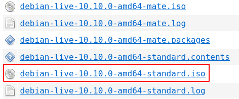
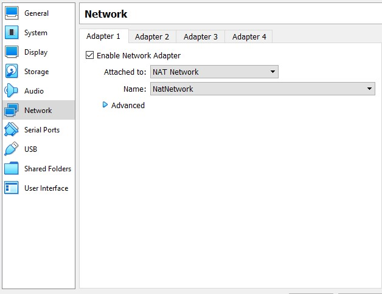
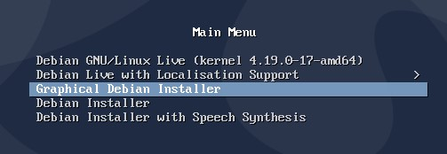

# 实验一：简单集群搭建

## 1 实验简介

本次实验要求使用四台虚拟机搭建一个简易的集群，并对该集群进行性能测试，最后提交测试结果和实验报告。

集群搭建的任务包括创建虚拟机、安装 Linux 发行版、配置网络和 ssh 通信。

性能测试通过使用 OpenMPI 将 HPL 测试程序分配到四个虚拟机节点上执行。因此，需要下载并编译 OpenMPI、BLAS 和 HPL 的源代码，其中 OpenMPI、BLAS是 HPL 的依赖项。

## 2 实验环境

- 一台计算机，操作系统任意
- Hypervisor (本手册为 Virtual Box)
- 虚拟机 * 4

## 3 实验基础知识介绍

### 3.1 计算机集群

[计算机集群](https://en.wikipedia.org/wiki/Computer_cluster)是连接在一起、协同工作的一组计算机，集群中的每个计算机都是一个节点。在集群中，由软件将不同的计算任务（task）分配（schedule）到相应的一个或一群节点（node）上。本次实验中，需要使用 OpenMPI 将 HPL 程序作为 task 分配到集群中的四个节点上。

#### 3.1.1 虚拟机

虚拟机为运行在其中的guest操作系统和应用提供了一个模拟的硬件环境，和真实的硬件保持一样的接口和表现，同时也如真实的硬件一样为其中的操作系统和程序提供保护机制、管理接口和资源限制。一个简易的非虚拟机和虚拟机结构的对比如下图（来源：Abraham Silberschatz, Peter Baer Galvin, Greg Gagn, *Operating System Concepts*, 10th edition, Chapter 18)

一种常见的虚拟机机制实现方式便是通过 hypervisor（又称VMM: Virtual Machnie Manager）来为 guest 操作系统提供模拟硬件环境，这也为在一台物理机上运行多个虚拟机提供了可能。

本手册中使用 Virtural Box 作为 hypervisor 进行示范和说明。


#### 3.1.2 Linux发行版

Linux 发行版（也被叫做 GNU/Linux 发行版），为一般用户预先集成好的 Linux 操作系统及各种应用 软件。一般用户不需要重新编译，在直接安装之后，只需要小幅度更改设置就可以使用，通常以软件包管理系统来进行应用软件的管理。Linux 发行版通常包含了包括桌面环境、办公包、媒体播放器、数据库等应用软件。这些操作系统通常由 Linux 内核、以及来自 GNU 计划的大量的函数库，和基于 X Window 的图形界面。现在有超过 300 个 Linux发行版。大部分都正处于活跃的开发中，不断地改进。由于大多数软件包是自由软件和开源软件，所以 Linux 发行版的形式多种多样——从功能齐全的桌面系统以及服务器系统到小型系统 (例如一些嵌入式设备)。除了一些定制软件 (如安装和配置工具)，发行版通常只是将特定的应用软件安装在一堆函数库和内核上，以满足特定用户的需求。

这些发行版可以分为商业发行版，比如 Ubuntu（Canonical 公司）、Fedora（Red Hat）、openSUSE （Novell）和 Mandriva Linux；和社区发行版，它们由自由软件社区提供支持，如 Debian 和 Gentoo；也有发行版既不是商业发行版也不是社区发行版，如 Slackware。

### 3.2 HPL

HPL是一个可以在分布式系统上运行的解稠密线性系统的软件包，同时也可以被用来做高性能计算Linpack测试（High Performance Computing Linpack Benchmark）。

关于HPL的详细介绍可参考 [https://www.netlib.org/benchmark/hpl/](https://www.netlib.org/benchmark/hpl/)

> The HPL software package **requires** the availibility on your system of an implementation of the Message Passing Interface **MPI** (1.1 compliant). An implementation of **either** the Basic Linear Algebra Subprograms **BLAS or** the Vector Signal Image Processing Library **VSIPL** is also needed. Machine-specific as well as generic implementations of [MPI](https://www.netlib.org/benchmark/hpl/links.html#mpi_libs), the [BLAS](https://www.netlib.org/benchmark/hpl/links.html#blas_libs) and [VSIPL](https://www.netlib.org/benchmark/hpl/links.html#vsip_libs) are available for a large variety of systems.

HPL 需要系统中有 MPI 实现和 BLAS 实现，因此我们需要在安装 HPL 前在虚拟机中安装 OpenMPI 和 BLAS。

OpenMPI 是一个开源的 [Message Passing Interface](http://www.mpi-forum.org/) 实现，由一些科研机构和企业一起开发和维护。MPI 是一套标准化、可移植的消息传递标准，它被设计用于支持并行计算系统的架构，使得开发者能够方便地开发可移植的消息传递程序。同时，MPI 编程能力在高性能计算的实践与学习中也是非常基础的技能。

BLAS 是 Basic Linear Algebra Subprograms 的缩写，本手册只要求将其作为 HPL 的依赖项下载安装即可，无需过多了解。

## 4 实验步骤

### 4.1 下载 Hypervisor 和 Linux 光盘映像文件

#### 4.1.1 Hypervisor

在创建虚拟机之前，你需要先准备好 Hypervisor，在本手册中，我们以 Virtual Box 为例，其他的 Hypervisor 请自行参阅相关材料：

- [Virtual Box 官网下载](https://www.virtualbox.org/wiki/Downloads)：

    

    > 注意**不要选错宿主机平台**！

- Docker

    由于本次实验希望大家从裸机手工完成完整的集群配置，包括网络和系统软件环境等，因此本次实验不推荐大家使用 Docker，如果学有余力可以尝试使用 Docker 复现本次实验，作为加分项（虚拟机为必做）。

#### 4.1.2 Linux 光盘映像文件

本手册所使用的范例发行版是 Debian 11，同学可根据自己的喜好和经验挑选适合的发行版。
Debian 下载点（如果网速问题可访问国内镜像）：


- [ZJU Mirror](https://mirrors.zju.edu.cn/debian-cd/current-live/amd64/iso-hybrid/)
- [Tuna Mirror](https://mirrors.tuna.tsinghua.edu.cn/debian-cd/current-live/amd64/iso-hybrid/)
- [Official Mirror](https://cdimage.debian.org/debian-cd/current-live/amd64/iso-hybrid/)



> 花花绿绿的映像，该怎么选择好呢？图中带有 mate 字眼的映像代表附有 mate 桌面，为了最精简安装，本手册采 standard 版本（不含桌面）。

- 不推荐使用的光盘映像

    - 从互联网下载 (关键字：Install via Internet / netinstall)

        此类镜像是在安装过程中访问互联网下载需要的包，由于虚拟机可能无法访问互联网，部分镜像虽然体积小但缺少很多重要的命令，因此不要挑选此类镜像。

    - 带有桌面环境的光盘映像 (关键字：Desktop / 以及后面带有 gnome, kde, lxde 等词的映像)

        如果计算机上的磁盘空间较不充足，建议不要下载带有桌面环境的光盘映像，如果你偏好桌面且空间足够可以忽略。

    - 你不熟悉的光盘映像 / 没有图形界面(GUI)安装程序的光盘映像

        Linux 发行版相当多，不熟悉或没使用过 Linux 的同学建议参考本手册，相信自己已经有一定基础的同学可以忽略。

### 4.2 搭建集群并安装相关程序

#### 4.2.1 创建虚拟机

准备好 Hypervisor 跟 光盘映像后，就可以着手安装一个虚拟机了，请参考 Virtual Box 手册和相关教程。

- 选择发行版、内存、磁盘空间

    
    

    选择自己要安装的发行版（如果没有直接选 Linux 即可），内存和磁盘空间根据实际情况分配。

- 插入发行版映像文件和配置网络

    

    选取刚下载的映像文件。

    

    网络对虚拟机来说十分复杂，如果你不熟悉相关的名词，在一台虚拟机的情况下，直接默认的 NAT 即可。选择 NAT 的另一个好处是，因为手册需要节点间彼此互连，因此使用 NAT Network 的同时，所有节点也可访问互联网。

    不需要互联网或者使用有线网的同学也可以考虑使用 Bridged 或 Internal Network，具体请参考手册上的说明：[Virtual Networking](https://www.virtualbox.org/manual/ch06.html)。

    > 小贴士
    > - 如果你的虚拟机无法连上网，可能是宿主机的问题，请**排查宿主机的网络状况**。
    > - 由于学校的网络情况，在学校中使用虚拟机的同学还是**以 NAT Network 为主**较方便。

- 进入图形安装程序

    在启动虚拟机后，不要直接进入 Live CD，直接进入安装程序，照着引导走即可。

    

- 安装完成并重启

    在刚刚插入映像文件的地方取消选取映像文件，否则下次重启时还会进入 Live CD。

#### 4.2.2 下载并安装 OpenMPI

由于系统中的包通常比较旧，因此我们从 OpenMPI 的官网中下载最新版本源码自行编译安装：[OpenMPI 下载](https://www.open-mpi.org/software/ompi/v4.1/)。

> 小贴士
> - 在虚拟机**可联网**的环境下，可直接使用 `wget` 或 `curl` 来下载，会方便许多。
> - 在编译前，先了解 `make` 和 `autoconf`，可以减少不少除错时间。

- 修改 `PATH` 和 `LD_LIBRARY_PATH`

    请将找到 OpenMPI 二进制文件的目录加入 `PATH` 环境变量，OpenMPI 库的目录加入 `LD_LIBRARY_PATH` 环境变量。

#### 4.2.3 下载并安装 HPL

下载地址：[https://netlib.org/benchmark/hpl/software.html](https://netlib.org/benchmark/hpl/software.html)

- BLAS

    HPL 的依赖除了一个 MPI 实现（在手册中是 OpenMPI）外，还需要一个 BLAS 实现，我们可以从 netlib 下载[其中一个实现](https://www.netlib.org/blas/#_software)，虽然没有优化过，但拿来测试已经足够了。

    - 检查 `gcc` / `gfortran` 环境

        BLAS 需要 `gcc` / `gfortran` 来编译，请务必检查自己虚拟机中编译器是否存在及其版本。

    - 编译 BLAS/CBLAS

        先编译 BLAS，再参考 `README` 和 `INSTALL` 修改 CBLAS 的 Makefile 并编译 （需要 BLAS 的链接文件）。

- 修改 HPL Makefile

    解压 HPL 压缩包后，在根目录的 `setup/` 文件夹下有 Makefile 相关文件的模板(Make.xxx，后缀代表架构)，复制到根目录并保存。

    参考 `README` ，根据自己情况修改以下参数：

``` Makefile
# Make.test
# arch
ARCH = test
...
# MPI
MPdir = /path/to/your/mpi/
MPinc = -I$(MPdir)/include64
MPlib = $(MPdir)/libmpi.so
# BLAS
LAdir = /path/to/your/blas
LAinc =
LAlib = $(LAdir)/lib
...
# compiler
CC = /path/to/your/mpicc
LINKER = $(CC)
```

&emsp;&emsp;修改当前目录下 `Make.top` 中的 `arch` 参数，需与 `Make.test` 中的一致。

- 编译

```shell
# 替换成你自己的后缀
make arch=test
```

#### 4.2.4 克隆节点

在 Virtual Box 中，克隆已经配置完成的节点成为集群中的其他节点，本手册范例中仅克隆一个（集群中两个节点），可克隆更多。

### 4.3 测试集群

#### 4.3.1 ping

`ping` 是测试节点网络连通性最为简单的方式，在进行其他测试前，请先确认能 `ping` 通所有节点。

#### 4.3.2 配置 ssh

`ssh` 是相当常用的，实现安全远程连接的方式，其原理和使用、配置方法请查阅相关参考资料：[Open SSH 网站](https://www.openssh.com/manual.html)
如果你没有 ssh 密钥，可以在其中一个节点创建一个：

```shell
ssh-keygen
```
我们需要将自己的 ssh 公钥复制一份到另一个节点上的 `.ssh/authorized_keys` 中（可以利用 `ssh-copy-id` 命令来拷贝公钥，也可以直接使用 `nc` 将公钥作为文件传输）。复制完成后，注意检查 `authorized_keys` (600) 和 `.ssh/` (700) 目录的权限，否则无法顺利  `ssh`。

- ssh passphrase

    如果自己的密钥有 passphrase，那么请使用 `ssh-agent` 确保能暂时不用输入 passphrase，以免之后影响 `mpirun` 正确运行。

#### 4.3.3 mpirun

尽管对 OpenMPI 十分陌生，我们还是能利用它来跑非 MPI 的程序，同学可以编写简单的 Helloworld 程序来测试 OpenMPI，或者直接使用 Unix 命令。

- OpenMPI hostfile

    两个节点都准备好后，我们可以试试 `mpirun` 了！按照如下格式，编写 MPI 的 hostfile 并保存：
    ```
    localhost slots=1
    10.0.2.5  slots=1
    ```
    其中 slots 代表的意思是一个节点的 CPU 有多少核，由于我们创建虚拟机时仅分配一个核，因此这里的 slots 上限为 1 ，同学根据自己虚拟机的情况，修改 slots 的值。

- 测试程序

    OpenMPI 需要测试程序为节点所共有或在节点上有相同路径，因为我们的第二个节点是克隆出来的，因此两个节点上的命令和 HPL 程序都会是相同路径，
    此时运行以下命令就能看到每个节点上线了多久：

```
mpirun --hostfile myhostfile uptime
```

- 运行 HPL：

```
mpirun --hostfile myhostfile ./xhpl
```

## 5 实验任务与要求

1. 搭建四个节点的虚拟机并记录过程，要求提供必要的截图或配置文件
2. 使用 OpenMPI 和 HPL 测试集群表现并记录结果
