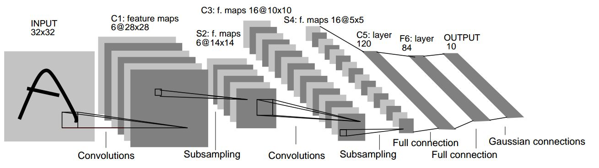
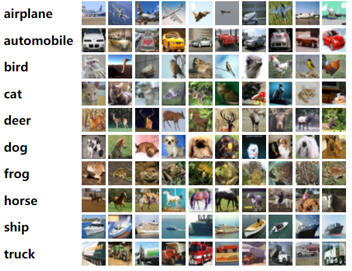

# 实验五：简单 CNN 网络训练


## 1 实验简介
**深度学习**（Deep Learning）是[机器学习](https://zh.wikipedia.org/wiki/机器学习)的分支，是一种以[人工神经网络](https://zh.wikipedia.org/wiki/人工神经网络)为架构，对资料进行表征学习的[算法](https://zh.wikipedia.org/wiki/算法)。深度学习能够取得如此卓越的成就，除了优越的算法、充足的数据，更离不开强劲的算力。近年来，深度学习相关的基础设施逐渐成熟，从网络设计时的训练、优化，到落地的推理加速，都有非常优秀的解决方案。其中，对于算力的需求最大的部分之一是网络的训练，它也因此成为 HPC 领域经常研究的话题。

**卷积神经网络**（Convolutional Neural Network, **CNN**）是一种[前馈神经网络](https://zh.wikipedia.org/wiki/前馈神经网络)，对于大型图像处理有出色表现。

本次实验我们将完成两个简单的 CNN 网络，并在 GPU 上加速它的训练，体会基本的网络设计、训练流程。


## 2 实验环境

请大家在我们提供的集群上创建一个开发环境为 PyTorch 的容器（要求最后在实验报告中展示环境基本信息）。容器中含有 Nvidia GeForce RTX 2080 Ti 及 PyTorch，无需自行配置。如果发现 PyTorch 版本过低请参照 4.1 中的环境配置方法更新 Python 与 PyTorch 版本。


## 3 实验基础知识介绍

### 3.1 网络模型

#### 3.1.1 CNN 卷积神经网络

卷积神经网络由一个或多个卷积层和顶端的全连通层（对应经典的神经网络）组成，同时也包括关联权重和池化层（pooling layer）。这一结构使得卷积神经网络能够利用输入数据的二维结构。与其他深度学习结构相比，卷积神经网络在图像和[语音识别](https://zh.wikipedia.org/wiki/语音识别)方面能够给出更好的结果。这一模型也可以使用[反向传播算法](https://zh.wikipedia.org/wiki/反向传播算法)进行训练。相比较其他深度、前馈神经网络，卷积神经网络需要考量的参数更少，使之成为一种颇具吸引力的深度学习结构。

#### 3.1.2 LeNet-5

LeNet-5是一个较简单的卷积神经网络。下图显示了其结构：输入的二维图像，先经过两次卷积层到池化层，再经过全连接层，最后输出每种分类预测得到的概率。



有关于其更详细的结构可以在[原论文](http://yann.lecun.com/exdb/publis/pdf/lecun-01a.pdf)中找到。

#### 3.1.3 其他 CNN 模型

LeNet-5 虽然在简单的分类任务上效果不错，但是并不能胜任更复杂的任务。因此你可能需要参考其他的 CNN 模型来设计一个更复杂的 CNN，这样才能完成第二个任务，即 CIFAR-10 上的图像分类任务。

你可以参考 VGG 等网络，也可以直接在 paper with code 上查找在 CIFAR-10 上表现优异的网络。

### 3.2 数据集

#### 3.2.1 MNIST 手写数字数据集

MNIST 数据集 (Mixed National Institute of Standards and Technology database) 是美国国家标准与技术研究院收集整理的大型手写数字数据库，包含 60,000 个示例的训练集以及 10,000 个示例的测试集。


MNIST 数据集下载： http://yann.lecun.com/exdb/mnist/index.html 

#### 3.2.2 CIFAR-10 / CIFAR-100 数据集

[CIFAR-10 和 CIFAR-100](http://www.cs.toronto.edu/~kriz/cifar.html) 是 [8000 万个微型图像数据集](http://groups.csail.mit.edu/vision/TinyImages/) 的标记子集。它们由 Alex Krizhevsky、Vinod Nair 和 Geoffrey Hinton 收集。

**CIFAR-10** 数据集包含 10 个类别的 60000 张 32x32 彩色图像，每类 6000 张图像。整个数据集由 50000 张训练图像和 10000 张测试图像组成。

官网下载到的数据集中包含5个batch，每个都由1000张各自类别的图像组成。

以下是数据集中的不同种类，以及每个种类的10张随机图像：



**CIFAR-100** 数据集和 CIFAR-10 数据集类似，不同之处在于它有 100 种类别，每种类别包含 600 张图像，分别为 500 张训练图像和 100 张测试图像。CIFAR-100 中的 100 个类别分为 20 个 superclass。每个图像都带有一个”精细”标签（它所属的类）和一个“粗”标签（它所属的超类）。

与 MNIST 数据集相比，CIFAR-10 是 3 通道的彩色 RGB 图像，而 MNIST 是灰度图像。CIFAR-10 的图片尺寸为 32 × 32 ，而 MNIST 的图片尺寸为28 × 28 ，略小于 CIFAR-10 的图像尺寸。


## 4 实验步骤
### 4.1 环境配置
#### 4.1.1 `Python` 环境配置
建议使用 `Anaconda` 配置。
#### 4.1.2 `Pytorch` 环境配置
参考[官方提供的配置方法](https://pytorch.org/get-started/locally/)。

### 4.2 数据准备

我们建议利用 `torchvision` 提供的 `torchvision.datasets` 方法导入数据，`torchvision.datasets` 所提供的接口十分方便，之后你可以用 `torch.utils.data.DataLoader` 给你的模型加载数据。

此外，我们也欢迎你自定义你的 `Dataset` 类，这样做会给你带来额外的分数。为此，你需要继承 `torch.utils.data.Dataset` 并至少需要重写其中的 `__len__()` 和 `__getitem__()` 函数，[这里](https://pytorch.org/docs/stable/data.html)有官方对 `torch.utils.data` 类的介绍，它或许可以帮到你。

幸运的是，本次实验需要用到的 `MNIST` 和 `CIFAR` 数据集都可用 `torchvision.datasets` 导入，下面对一些你可能会用到的参数简单加以说明

**注意：请在清楚参数含义后调用它们**

```Python
# MNIST
torchvision.datasets.MNIST(root, train=True, transform=None, target_transform=None, download=False)
# CIFAR-10
torchvision.datasets.CIFAR10(root, train=True, transform=None, target_transform=None, download=False)
# CIFAR-100
torchvision.datasets.CIFAR100(root, train=True, transform=None, target_transform=None, download=False)
```
一些重要的参数说明：
 - root: 在`MNIST`中是 `processed/training.pt` 和 `processed/test.pt` 的主目录，在 `CIFAR` 中为 `cifar-10-batches-py` 所在的目录
- train: `True` 代表训练集，`False` 代表测试集
- transform 和 target_transform: 分别是对图像和 label 的转换操作
- download: 若为 `True` 则下载数据集并放到 `root` 所指定的目录中，否则直接尝试从 `root` 目录中读取

你可以在[这里](https://pytorch.org/vision/0.8/datasets.html)获取更加详细的说明

### 4.3 模型编写

#### 4.3.1 网络结构
`PyTorch` 提供了许多种定义模型的方式，最常用的一种是将网络结构以类保存，你应当首先继承 [torch.nn.Module](https://pytorch.org/docs/stable/generated/torch.nn.Module.html#torch.nn.Module)，并实现正向传播的 `forward` 函数，(为什么不用定义反向传播函数呢？因为你继承的 `nn.Module` 就是干这个事情的)。

下面为网络结构的一个 sample（但显然这样的网络并不能用于本次 Lab），本次实验中你需要自定义你的网络结构，以完成我们的分类任务：
```Python
import torch.nn as nn
import torch.nn.functional as F

class Model(nn.Module):
    def __init__(self):
        super(Model, self).__init__() # 利用参数初始化父类
        self.conv1 = nn.Conv2d(1, 20, 5)
        self.conv2 = nn.Conv2d(20, 20, 5)

    def forward(self, x):
        x = F.relu(self.conv1(x))
        return F.relu(self.conv2(x))
```

当然，你需要实例化你的模型，可以直接对模型打印以查看结构
```Python
model = Model()
print(model)
```
网络结构编写中一个很大的难点在于每一步的 tensor shape 需要匹配，请仔细检查你的代码来确保此部分的正确性。

#### 4.3.2 损失函数

常见的损失函数都被定义在了`torch.nn`中，你可以在训练过程开始前将其实例化，并在训练时调用，例如：
```Python
criterion = torch.nn.CrossEntropyLoss()
```

#### 4.3.3 正向传播
正向传播是指对神经网络沿着从输入层到输出层的顺序，依次计算并存储模型的中间变量（包括输出）。
正向传播的过程在`forward`中定义，对于模型实例，可以直接利用输入输出得到模型预测的结果。
```Python
y_pred = model(x)
```

#### 4.3.4 反向传播

反向传播（Backpropagation，BP）是“误差反向传播”的简称，是一种与最优化方法（如梯度下降法）结合使用的，用来训练人工神经网络的常见方法。该方法对网络中所有权重计算损失函数的梯度。这个梯度会反馈给最优化方法，用来更新权值以最小化损失函数。

在计算过模型的loss之后，可以利用 `loss.backward()` 计算反向传播的梯度，梯度会被直接储存在 `requires_grad=True` 的节点中，不过此时节点的权重暂时不会更新，因此可以做到梯度的累加。

#### 4.3.5 优化器
常用的优化器都被定义在了 `torch.optim` 中，为了使用优化器，你需要构建一个 optimizer 对象。这个对象能够保持当前参数状态并基于计算得到的梯度进行参数更新。你需要给它一个包含了需要优化的参数（必须都是 Variable 对象）的iterable。然后，你可以设置optimizer的参数选项，比如学习率，权重衰减，例如：
```Python
optimizer = optim.SGD(model.parameters(), lr=0.01, momentum=0.9)
optimizer = optim.Adam([var1, var2], lr=0.0001)
```
所有的optimizer都实现了step()方法，这个方法会更新所有的参数。或许你会在反向传播后用到它。
```Python
optimizer.step()
```
需要注意的是，在反向传播前，如果你不希望梯度累加，请使用下面的代码将梯度清零。
```Python
optimizer.zero_grad()
```
### 4.4 训练过程
前文中已经定义了网络结构、损失函数、优化器，至此，一个较为完整的训练过程如下，需要注意的是，你的训练过程要不断从 `DataLoader` 中取出数据。
```Python
criterion = torch.nn.MSELoss(reduction='sum')
optimizer = torch.optim.SGD(model.parameters(), lr=1e-8, momentum=0.9)
for t in range(30000):
    # Forward pass: Compute predicted y by passing x to the model
    y_pred = model(x)

    # Compute and print loss
    loss = criterion(y_pred, y)

    # Zero gradients, perform a backward pass, and update the weights.
    optimizer.zero_grad()
    loss.backward()
    optimizer.step()
```
多卡的训练需要配置 [DDP](https://pytorch.org/docs/stable/notes/ddp.html)，作为加分项。

#### 4.4.1 TensorBoard

TensorBoard 是常用的训练过程可视化工具。请参考 [PyTorch](https://pytorch.org/tutorials/recipes/recipes/tensorboard_with_pytorch.html) 的官方教程完成配置。


### 4.5 Tips
- `nn.functional.ReLU`  （简记为 `F.ReLU` ）和 `nn.ReLU` 略有不同，区别在于前者作为一个函数调用，如 4.3.1 中所示，而后者作为一个层结构，必须添加到 `nn.Module` 容器中才能使用，两者实现的功能一样，在 `PyTorch` 中，`nn.X` 都有对应的函数版本 `F.X`。
- 除了利用继承 `nn.Module` 来建立网络，不推荐但可以使用 `nn.ModuleList`, `nn.ModuleDict`，推荐使用`nn.Sequential`直接定义模型
- 你可以定义如下的 `device` 变量，以便你的模型在没有 GPU 环境下也可以测试：
```Python
device = torch.device("cuda" if torch.cuda.is_available() else "cpu")

model = Model().to(device)
some_data = some_data.to(device)
```
- 相比于原生的 `PyTorch`，`PyTorch Lightning` 框架对其进行了更高层次的封装，很大程度上简化了模型定义、训练以及测试的步骤，使用 `PyTorch Lightning` 作为本次实验的加分项，官网链接已附在参考资料中。如果你能够在 TensorBoard 中将中间层可视化，你能得到更多的加分。


## 5 实验任务与要求

1. 使用 `PyTorch` 实现最基本的卷积神经网络 LeNet-5，并在 MNIST 数据集上使用 GPU 进行训练，并对测试集进行测试。

2. 使用 `PyTorch` 实现更复杂的卷积神经网络，结构可以自行设计，并在CIFAR 10 数据集上使用 GPU 进行训练，并对测试集进行测试。

3. 回答问题：

   1. 池化层有很多种，较常使用的是平均和最大，在这个数据集上使用有什么的区别，哪个效果好一些？

   2. 修改网络结构以求得到更好的效果，可能的修改方向有：

       a. 调整卷积窗口的大小、步长

       b. 调整卷积层的数量

       c. 调整全连接层的数量

       d. 调整激活函数
       
       e. 调整输出通道的多少
       
       **你采用了哪些策略来改进你的网络，效果如何？**

4. 你需要提交：
   1. 全部代码
   2. 实验报告，其中需要包含：
      1. 简要实验过程
      2. 贴上两个 CNN 模型训练过程的 **GPU 占用率截图**（使用 `nvidia-smi` 查看）
      3. Tensorboard **损失曲线、准确率曲线等截图**
      4. 写明测试集上的**识别正确率**
      5. 回答 3 中的问题

5. ***不允许直接使用各种深度学习开发工具已训练好的 CNN 网络结构与参数。***

6. ***本次实验依然会进行查重，如果你参考了网络上的代码请在报告中列出，并体现出你的理解，否则一经查出视为抄袭***


## 参考资料

- `PyTorch` 框架 https://pytorch.org/
- `PyTorch Lightning` 框架 https://www.pytorchlightning.ai/

- MNIST 数据集 http://yann.lecun.com/exdb/mnist/index.html

- CIFAR 10/100 数据集 http://www.cs.utoronto.ca/~kriz/cifar.html

- LeNet-5 网络结构 http://yann.lecun.com/exdb/lenet/
